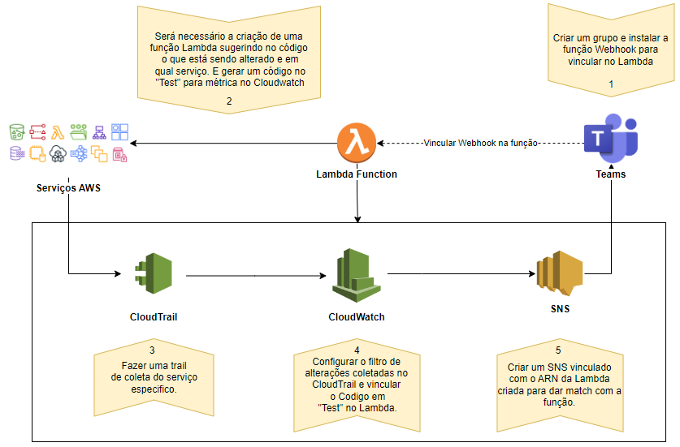

## Documentação criada visando guiar a criação de notificações de alterações nos Recursos da AWS

* Criar um grupo no Teams com Webhook
* Criar o código que irá notificar via Lambda
* Criar um Cloud Trail para coleta das alterações nos serviços
* Criar conf no Cloudwatch para filtrar as alterações feitas
* Criar um SNS para gerar a notificação via Teams

# Passo-a-Passo

## Teams

Será necessário criar um _Chat_ no Teams e baixar a extenção _Webhook_ para gerar o link de intergração.

## Lambda
Será necessário criar uma função Lambda para gerar as notificações automaticas. Nessa função será necessário descrever os _eventnames_ e as descrições das mensagens(OBS: Todos os exemplos abaixo, estão em python 3.7).

OBS: O _eventname_ irá variar para cada serviço da AWS, o recomendado é localizar o _eventname_ através do CloudTrail ou Cloudwatch. Ou na seguinte referencia: <https://www.gorillastack.com/blog/real-time-events/cloudtrail-event-names/>.

## CloudTrail
Ao criar o CloudTrail, deverá ser:
* Criar um _bucket_s3_ para armazenar os logs gerados. 
* Habilitar _tópico-SNS_ e também o _CloudWatch-Logs_.
* Desabilitar _Criptografia SSE-KMS do arquivo de log_. 
* Habilitar a opção _Evento de dados_ e selecionar a fonte de dados = S3.
* Revisar e criar a tilha.

## SNS
Após abrir o SNS deverá ser informado um tópico e uma assinatura para o mesmo para isso deverá ser:
* Ir em _Tópicos_ e criar um novo tópico.
* Configurar com:
  * Standard
  * Nomear
  * Configurar Access Policy
  * Advanced
    * Incluir com o JSON:
~~~json
{
  "Version": "2012-10-17",
  "Id": "__default_policy_ID",
  "Statement": [
    {
      "Sid": "__default_statement_ID",
      "Effect": "Allow",
      "Principal": {
        "AWS": "*"
      },
      "Action": [
        "SNS:GetTopicAttributes",
        "SNS:SetTopicAttributes",
        "SNS:AddPermission",
        "SNS:RemovePermission",
        "SNS:DeleteTopic",
        "SNS:Subscribe",
        "SNS:ListSubscriptionsByTopic",
        "SNS:Publish"
      ],
      "Resource": "ARN DO SNS",
      "Condition": {
        "StringEquals": {
          "AWS:SourceOwner": "842136179073"
        }
      }
    },
    {
      "Sid": "AWSCloudTrailSNSPolicy20150319",
      "Effect": "Allow",
      "Principal": {
        "Service": "cloudtrail.amazonaws.com"
      },
      "Action": "SNS:Publish",
      "Resource": "ARN DO SNS",
      "Condition": {
        "StringEquals": {
          "AWS:SourceArn": "ARN DO CLOUDTRAIL"
        }
      }
    },
    {
      "Sid": "ARN DO EVENTBRIDG",
      "Effect": "Allow",
      "Principal": {
        "Service": "events.amazonaws.com"
      },
      "Action": "sns:Publish",
      "Resource": "ARN DO SNS"
    }
  ]
}
~~~
* Criar Tópico.
* Ir em _Assinaturas_ e criar uma nova assinatura.
* Informar o _ARN DO TÓPICO_.
* Informar o protocolo = _lambda_ e na sequencia informar o _ARN LAMBDA CRIADO PARA EVENTO ESPECÍFICO_.
* Revisar e criar a assinatura.

## CloudWatch
Ao abrir a guia do CloudWatch, ir na opção _Regras_ localizada dentro de _Eventos_, ao criar a _Regras_, deverá ser:
* Informar a origem do evento no campo _Nome do Serviço_.
* Em tipo de evento informar _AWS API Call via CloudTrail_.
* Marcar _Operações específicas_e informar os _eventsnames_ desejados.(Pode ser informado o json sugerido como teste do lambda).
* Em destino, informar o _SNS_ desejado e deverá ser adicionado mais um destino informando o _ARN LAMBDA CRIADO PARA EVENTO ESPECÍFICO_.
* Revisar e criar o evento.

## Após realizar todas as configurações efetuar o teste, caso o mesmo tenha exito, será notificado no seu teams.

## Referências
* <https://aws.plainenglish.io/how-to-send-aws-notifications-to-microsoft-teams-2f4df243543f>
* <https://www.gorillastack.com/blog/real-time-events/cloudtrail-event-names/>
* <https://cybersecurity.att.com/documentation/usm-anywhere/user-guide/events/cloudtrail-events-rules.htm>
* <https://www.intelligentdiscovery.io/tools/cloudtrailevents>

